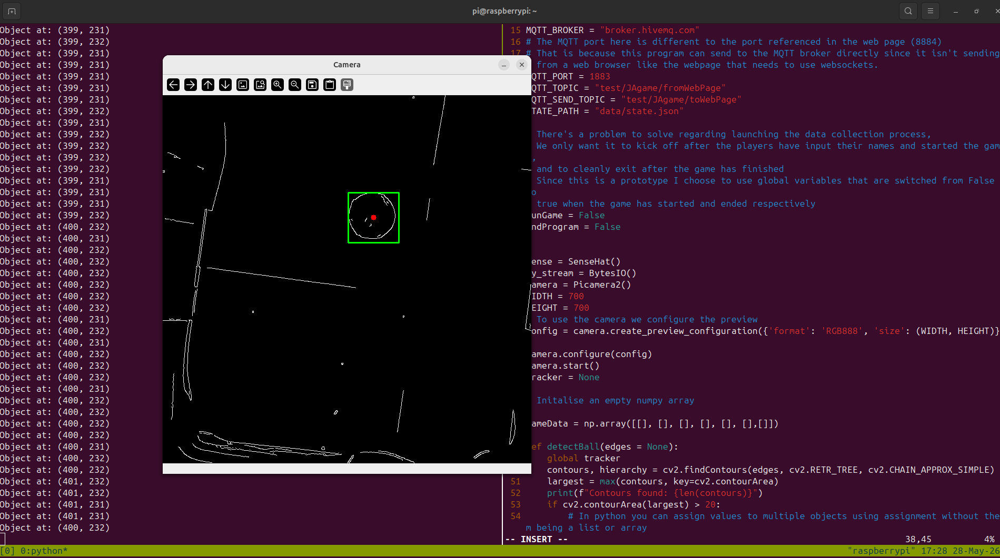

## JAgameCollect

This program is the data collection service of the Joint Action game platform and the backend of the corresponding web page (see PowerShift https://github.com/Callumwils00/ScoreBoard).

JAgameCollect uses a raspberrypi to collect visual and gyroscopic information about the Joint action game (See proposal) and send on relevant information to the webpage over MQTT and the database over http. 

## Setup

Below I have given comprehensive information on setting up the experiment. Some of it is relevent to the experiment setup itself (the vision problem discussion) the rest is targetted at a lab technition or experimenter with some basic knowledge of unix/linux.

### Requirements:

* A raspberrypi compatible with the camera module 3 and the sense hat. This platform was developed on a raspberrypi 4B, but should work on other RPi's with the 40-pin GPIO headers.
 * A camera module 3. You will need to callibrate this for your own experimental setup. A raspberrypi fisheye lense for the camera may also be useful.
 * A sense hat
 * python3 
 * A computer with a camera application to monitor the experiment and an SSH key for the pi

The lab will need a raspberrypi set up to run JAgameCollect and a separate machine to host the RESTJA API and database. This is because the JAgameCollect program is designed to be run in an always running process using systemd. The API should be hosted on a machine that is never turned off, or on a cloud service. If the experimenter wishes to not run JAgameCollect on systemd they can elect to ssh into the raspberrypi and run the JAgameCollect program manually for each trial. I would recommend, if the lab doesn't want any data leaving the building to use an old machine or SBC that can run Debian Linux or Debian based distro. See the API README, it was developed on Ubuntu 24 and tested using a laptop for hosting.

If the experimenter wishes to monitor the ball tracking computer vision process using their laptop they can ssh in using x11 and allow their laptop to show the computer vision output stream. I have used this for testing using a laptop running Ubuntu linux, other operating systems that run different camera apps may need aditional configuration. 

It is assumed that a technicion will set up the experiment and that the experimenter will analyse the data using an api call using Python/MATLAB/R but that outwith analysing their data the experimenter doesn't have programming skills.


## Vision Science problem

We need to find the position of the center of the ball from frame to frame.

## Pipeline

1. A frame is caputured using the piCamera and the Picamera2 method .capture_array(). This frame will be an array of pixel values from 0 to 255.

### Object ***Detection***

2. Find the Edges. First the frame is converted to grayscale using the opencv COLOR_RBG2GRAY field [1] and gaussian blur is applied to smooth over some of the small high frequency intensity changes in the frame.

3. The changes in the intensity of the frame is used to detect edges. Actually canny edge detection is used over laplacian. But the basic idea is that the zero-crossings are found by getting the second derivative of the gaussian of the frame (see Marr Hildreth edge detection [2]  as a starting point, and then canny edge detection).

4. The edges are linked up into contours, ie. continuous edges and the largest contour is found. This step is important since artifacts (objects that aren't the ball like where the white paper on the bottom of the surface)  can be and are often detected.

### Object ***Tracking***

    5 An adaption on the MOSSE (Minimum Output Sum of Square error) algorithm [3]  is used to track the ball from frame to frame. This approach (Tracking) is more computationally efficient that running the detection stage alone on ever frame. The basic idea of MOSSE (and CSRT which was actually used) is to learn the object statistics from the first frame captured and then use this found information in subsequent frame, adapting the object statistics from frame to frame, allowing for slight changes (for example how the electrical tape covering the ball creates slight creases which make it not exactly spherical).
    
        - 5.1 If the tracker looses the ball the function goes back to step 2, and detects the ball again.

## X11

To run the experiment the experimenter will need to ssh into the pi. The camera app on the experrimenters machine will automatically launch and will display the stream of information being picked up and used by the computer vision algorithm. The countours of the scene and the place in the scene that the detection of tracking parts of the Computer vision pipeline as the object of interest will be displayed. I considered setting up the experiment to run on systemd so that it would always be running, but that wouldn't be practical as the experimenter would really need to monitor the Computer vision pipeline using their computer because sometimes light artifacts cause issues. 
The experimenter can press "q" any time to quit the camera app and the game. In the case data will still be send to the api, but it is expected that the experimenter would remove any game where there was no winner from the analysis, as they would indicate that the vision pipeline didn't capture the ball movement properly


```
# Here are the commands the experimenter would need to run to run a trial

ssh -X pi@raspberrypi.local 

cd JAgame

source .venv/bin/activate

python main.py

```



First set up ssh keys on the experimenters machine and the raspberrypi

On the experimenters laptop run generate an ssh key

```
ssh-keygen -t ed25519 -c "emailaddress@example.com"

# accept the default location to store the key in the .ssh folder
```

Copy the public ssh key to the RPI

```
scp ~/.scp/id_ed25519 pi@raspberrypi.local:~/.ssh

```

Once this key is set up the Rpi can be ssh's into without needing to enter a password. This is important for making code modification with local ide's possible and using x11 to monitor the experiment.


Now to set up x11

First update the pi and install openssh-server.

```
sudo apt update
sudo apt install openssh-server
```
\
Now open the sshd configuration file

```
sudo vim /etc/ssh/sshd_config
```
\
In this file navigate to the commented out line "#X11Forwarding yes" and uncomment
\
Then restart the ssh service

```
sudo systemctl restart ssh 
```

Now when the experimenter ssh's into the pi using 

```
ssh -X pi@raspberrypi.local

```
and runs the experiment the camera app on their laptop will behave as described above.

## MQTT

## HTTP
 
# References 

[2] https://doi.org/10.1098/rspb.1980.0020

[3] https://doi.org/10.1109/CVPR.2010.5539960

[4] https://docs.github.com/en/authentication/connecting-to-github-with-ssh/generating-a-new-ssh-key-and-adding-it-to-the-ssh-agent

[5] https://linuxconfig.org/how-to-enable-x11-forwarding-on-raspberry-pi


